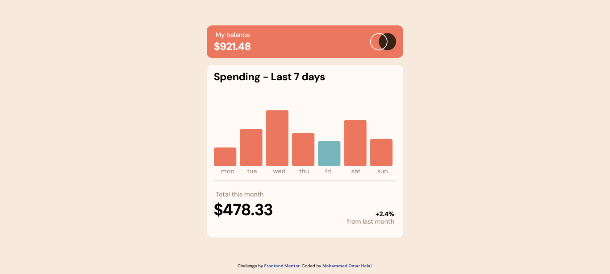
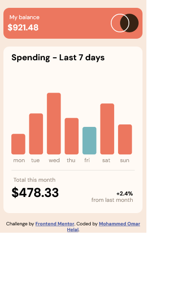

# Frontend Mentor - Expenses chart component solution

This is a solution to the [Expenses chart component challenge on Frontend Mentor](https://www.frontendmentor.io/challenges/expenses-chart-component-e7yJBUdjwt). Frontend Mentor challenges help you improve your coding skills by building realistic projects.

## Table of contents

- [Overview](#overview)
  - [The challenge](#the-challenge)
  - [Screenshot](#screenshot)
  - [Links](#links)
- [My process](#my-process)
  - [Built with](#built-with)
  - [What I learned](#what-i-learned)
  - [Continued development](#continued-development)
  - [Useful resources](#useful-resources)
- [Author](#author)

## Overview

### The challenge

Users should be able to:

- View the bar chart and hover over the individual bars to see the correct amounts for each day
- See the current day’s bar highlighted in a different colour to the other bars
- View the optimal layout for the content depending on their device’s screen size
- See hover states for all interactive elements on the page
- **Bonus**: Use the JSON data file provided to dynamically size the bars on the chart

### Screenshot

### Links

- Solution URL: [Github Repo](https://github.com/MohammedHelal/expenses-chart)
- Live Site URL: [Expense Chart Site](https://mohammedhelal.github.io/expenses-chart/)

## My process

### Built with

- Semantic HTML5 markup
- CSS custom properties
- Flexbox
- CSS Grid
- Mobile-first workflow
- [React](https://reactjs.org/) - JS library
- [D3](https://d3js.org/) - D3 JS library

### What I learned

I got to practice using D3 library to draw a chart based on the information.

### Continued development

I still need to practice more to be able to use D3 without much issues since I needed to go back a few times and look at the documentation to be able to do it.

### Useful resources

- [D3 JS tutorial](https://www.freecodecamp.org/news/d3js-tutorial-data-visualization-for-beginners/) - This helped me understand how to use D3.

## Author

- CodeSandBox - [MohammedHelal](https://codesandbox.io/u/MohammedHelal)
- Frontend Mentor - [@MohammedHelal](https://www.frontendmentor.io/profile/MohammedHelal)
